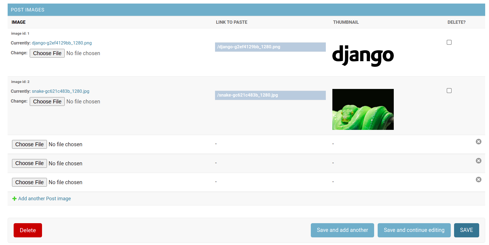

# django-wysiwyg-image #

An easy way to paste images to wysiwyg editors in Django admin interface. All it needs from you is to download an image through standard Django interface, and you will get a url to provide to your wysiwyg editor.

Requirements:
-------------
Application was tested with Python 3.6 and Django 3.2

Installation:
-------------

Install using ``pip``...

    pip install django-wysiwyg-image

Add ``'wysiwyg_img'`` to your ``INSTALLED_APPS`` setting.

        INSTALLED_APPS = [
        ...
        'wysiwyg_img',
    ]


**Usage:**

>Important! This tutorial does not cover basic Django configurations, installations of third party apps like django-tinymce, Pillow etc.

Let's imagine we have a ``posts`` app in Django project with ``Post`` model in which we want to paste images by wysiwyg editor in admin interface(in our case django-tinymce editor). First up we're going to import ``BaseImageModel`` from ``wysiwyg_img.models`` and inherite from it our ``PostImage`` model. Then we have to tie by ``ForeignKey`` ``PostImage`` model to ``Post`` model. Now our ``models.py`` file should look like this:

```
from django.db import models

from tinymce import models as tinymce_models

from wysiwyg_img.models import BaseImageModel


class Post(models.Model):
    title = models.CharField(max_length=100)
    tiny_mce = tinymce_models.HTMLField()


class PostImage(BaseImageModel):
    post = models.ForeignKey(Post, on_delete=models.CASCADE)
```
Run ``./manage makemigrations`` and ``./manage.py migrate``.

We also need to do some configurations in ``admin.py`` file of current application:

```
from django.contrib import admin

from wysiwyg_img.admin import ImageInline

from posts.models import Post, PostImage


class ImageInline(ImageInline):
    model = PostImage

class PostAdmin(admin.ModelAdmin):
    inlines = [
        ImageInline,
    ]

admin.site.register(Post, PostAdmin)

```
That's all! Now in admin interface we have fields to download unlimited images associated with ``Post`` model. Each field has ``LINK TO PASTE`` value to provide to your WYSIWYG editor. Just copy it and paste to the editor window. Pay attention! Editors may not include image plugins by default. Fields also have thumbnails and delete checkboxes for convenient way of managing images.


Settings:
---------

There are two possible configurations available through ``django.conf.settings`` module.

**WYSISWYG_IMG_UPLOAD_TO**

    Default: ''

String represents path to downloaded images under your ``MEDIA_ROOT``
>Important! Every time you change this setting, you must run ``makemigrations`` and ``migrate`` command to create and apply migrations.

<br/>

**WYSISWYG_IMG_IMAGE_WIDTH**

    Default: 150

Integer represents thumbnail width in Django admin interface.

Note
----

``django-wysiwyg-image`` app does not delete images from your filesystem automatically when you click delete button, so you'll have to implement deleting the images from the filesystem by yourself. Or you can use a brilliant app [django-cleanup](https://github.com/un1t/django-cleanup).